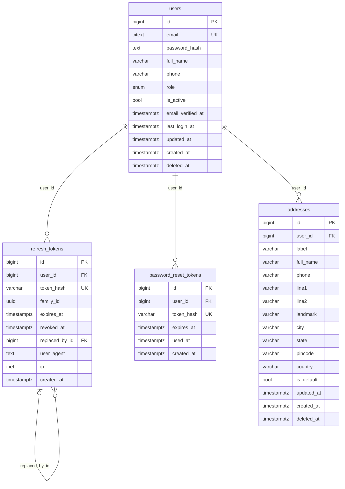
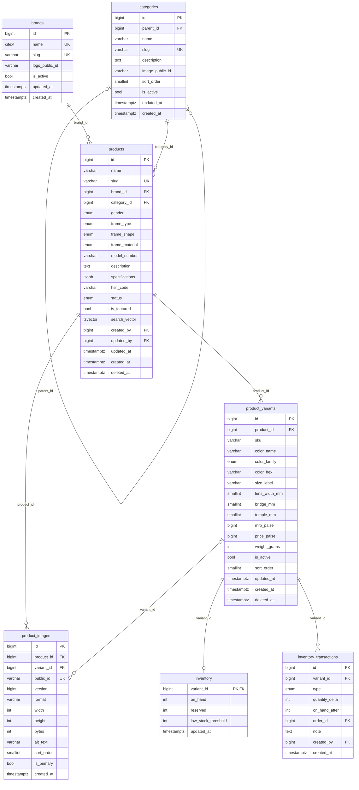
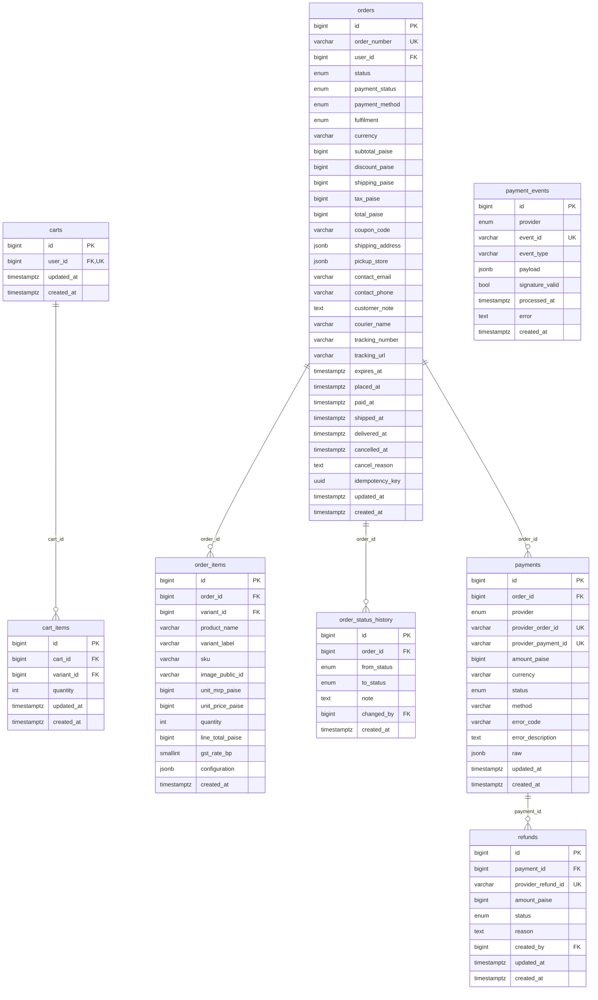
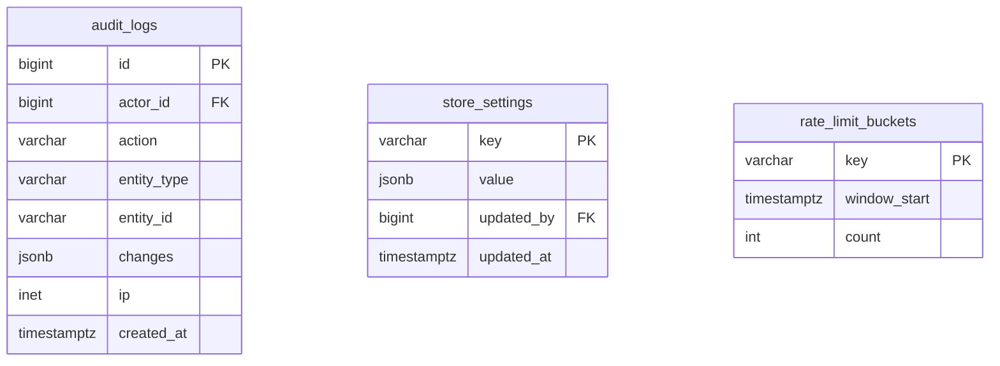

# Database

Generated from the SQLAlchemy models by `uv run python -m app.cli er-diagram`;
don't edit by hand. Design notes: `ARCHITECTURE_PLAN.md` §I. Links to tables in
another section appear only as FK columns.

Conventions: money is integer paise; times are UTC `timestamptz`; `enum` columns are
varchar limited by a CHECK constraint; PK = primary key, FK = foreign key, UK = unique.

## Accounts

## Catalogue and stock

## Cart, orders and payments

## Admin

